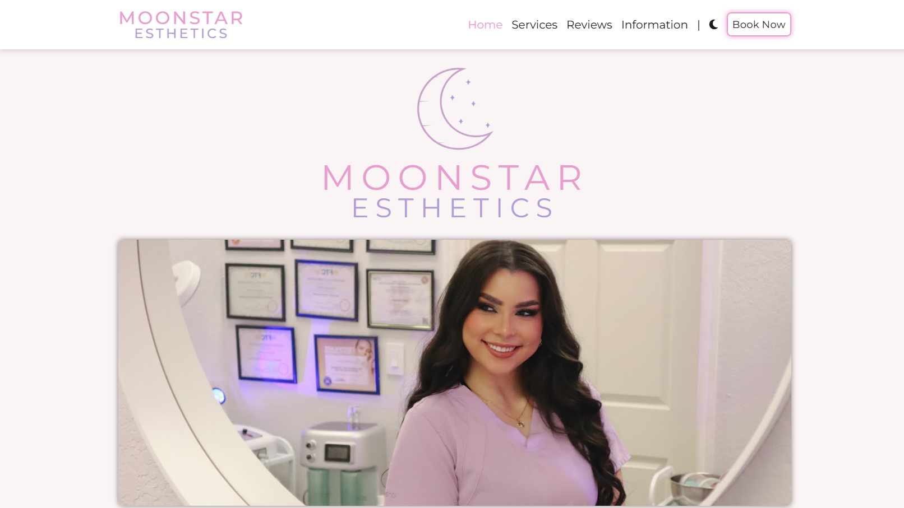
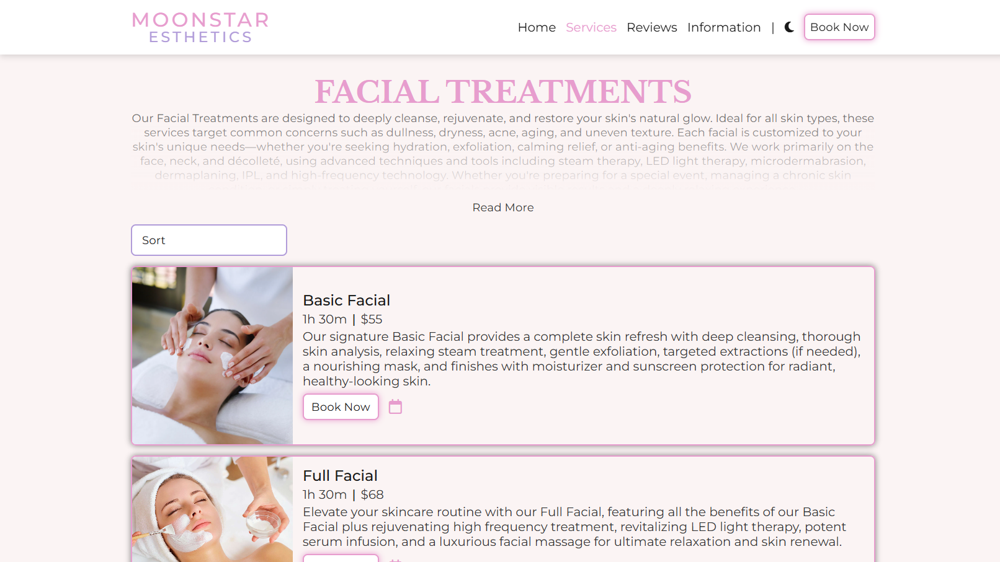
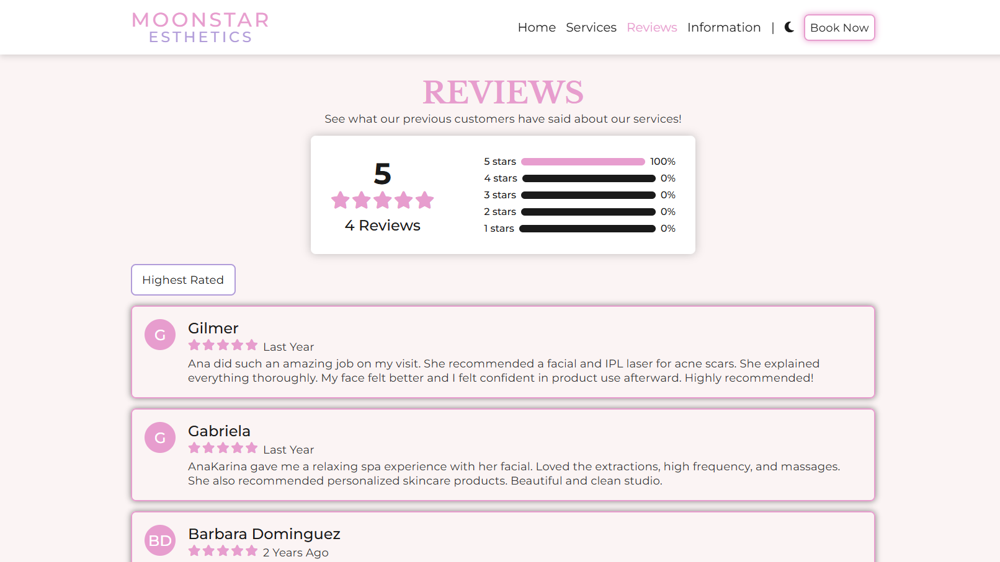
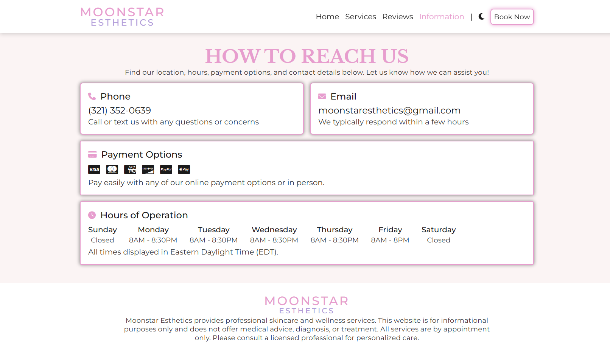

# Moonstar Esthetics

## Description

Moonstar Esthetics is a modern, responsive web application built to showcase the full range of skincare, laser/IPL, and waxing services offered by Moonstar Esthetics. It addresses the common problem of outdated or hard-to-navigate websites in the beauty industry by providing a professional, user-friendly online presence that highlights the quality and breadth of services.

- **Problem:** Many beauty and esthetics businesses struggle with outdated websites that fail to effectively communicate their services, pricing, and value proposition to potential clients. This creates barriers to client engagement and business growth.

- **Solution:** Moonstar Esthetics provides a comprehensive, modern web platform that clearly presents all services with detailed descriptions, pricing, and duration information. The site features intuitive navigation, client testimonials, and seamless booking integration, making it easy for clients to discover and book services.

- **Methodology:** Built with Next.js using the App Router architecture, the application follows a component-based design pattern with server-side rendering for optimal SEO and performance. The site uses CSS Modules for scoped styling, JSON for structured data management, and implements client-side interactivity where needed while maintaining fast initial page loads through Next.js optimizations.

**Live Demo:** [Link to Deployed Application](https://moonstar-esthetics.vercel.app/)

## Table of Contents

- [Features](#features)
- [Mock Up](#mock-up)
- [Technology Stack](#technology-stack)

## Features

- **Legal Pages:** Includes Privacy Policy and Terms of Service for compliance and transparency, with dynamic date updates.

- **Contact & Inquiry:** Easy-to-use contact form for questions and appointment requests, with direct integration to email clients.

- **Responsive Design:** Fully mobile-friendly layout ensures a seamless experience on all devices, with a mobile-optimized navigation sidebar and adaptive layouts.

- **Client Reviews:** Real client testimonials build trust and credibility. The reviews page features an average rating display, rating distribution, and sortable review cards.

- **Modern UI with Theme Toggle:** Clean, elegant design with smooth transitions and interactive elements. Includes a light/dark theme toggle that respects user system preferences and persists across sessions.

- **Service Catalog:** Browse detailed listings for facial, laser/IPL, body, and waxing treatments, each with images, descriptions, pricing, and duration. Services can be sorted by price or duration for easy comparison.

## Mock Up

The following images demonstrate the web application's appearance and functionality:

## Technology Stack

**Frontend:**

- **CSS Modules:** Scoped, maintainable styles for each component
- **JavaScript (ES6+):** Modern language features for robust, maintainable code
- **React 19:** Component-based UI library for building interactive user interfaces
- **Next.js 16:** React framework with App Router for server-side rendering, static generation, and optimized performance

**Backend:**

- **Next.js API Routes:** Server-side functionality and routing (if needed for future enhancements)

**Other Technologies:**

- **Font Awesome:** Icon library for UI elements
- **JSON:** Structured data storage for services and reviews
- **Google Fonts:** Montserrat and Libre Baskerville typography

---
